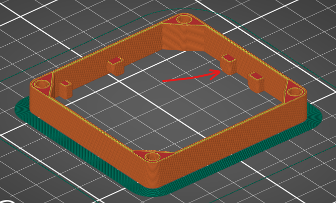
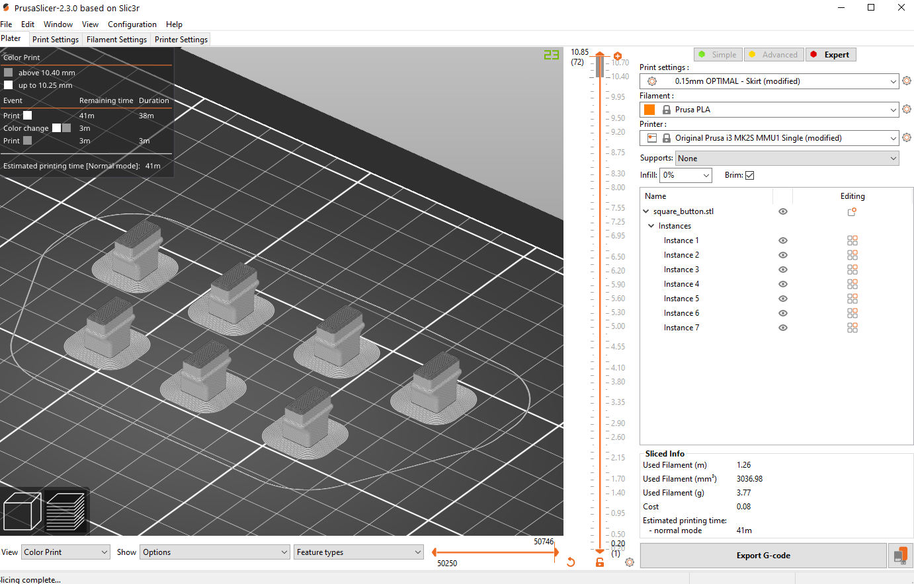
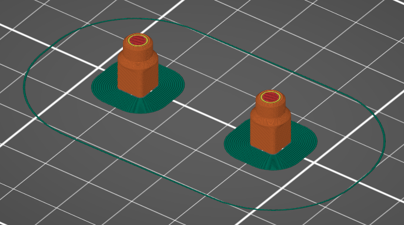
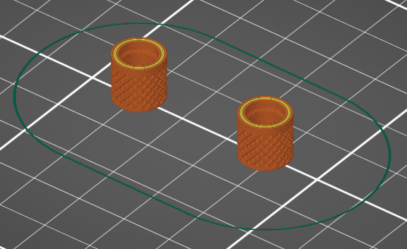
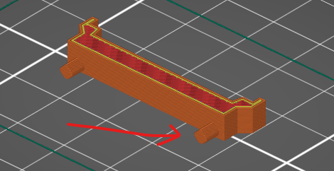
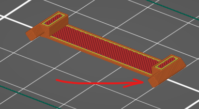

### FS Macro Panel

* Filament used on the assembled models:
  * Prusa Silver PLA (non-glitter)
  * Prusa Clear PLA

---
#### Body (x1)

[body.stl](body.stl)

Print this way up:

* Layer height: 0.35mm
* Infill: 10%
* Consider using a brim to avoid first layer issues or warping

---
#### Square Buttons (x7)

[square_button.stl](square_button.stl)
* Use a transparent filament for the base, and silver for the top.
* Set a filament change on layer 69 in your slicer so the last 4 layers are in Silver.

Designed to be printed either way up. They are best printed the right way up with 'ironing' enabled for the top layer.

  
* Layer height: 0.15mm
* Infill: 0%
* Small base, consider using a brim.
  

##### Separate parts for multi-material printers:
* [Preview Image](img/square_buttons_multi_material.png)
* [square_button_base.stl](square_button_base.stl)
* [square_button_face.stl](square_button_face.stl)

---
#### Modifier Buttons (x2)

[modifier_button.stl](stl/modifier_button.stl)

Can be printed either way up. They are best printed the right way up with 'ironing' enabled for the top layer.

* Layer height: 0.15mm
* Infill: 0%
* Small base, consider using a brim.

---
#### Dial Caps (x2)

*WIP - STL will be added soon!*

Print upside down

* Layer height: 0.15mm
* Infill: 0%

---
#### Oled spacer (x1)

[oled_spacer_3.3mm.stl](oled_spacer_3.3mm.stl)

Print on it's side with the notches lying on the print bed.

* Layer height: 0.15mm
* Infill: 10%

---
#### Oled pin spacer (x1)

[oled_pin_spacer_3.3mm.stl](oled_pin_spacer_3.3mm.stl)

Print on it's side with the notches lying on the print bed.

* Layer height: 0.15mm
* Infill: 10%
