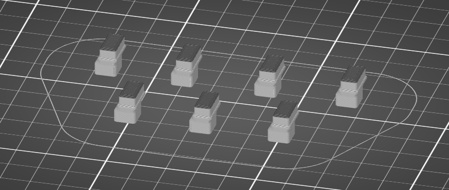
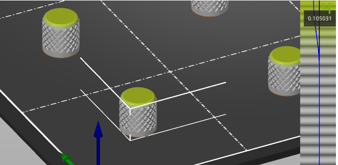

### FS Macro Panel

Filament Guidelines
* Silver
  * Prusa Silver PLA (non-glitter)
  * Amazon Basics Silver PLA
  * Basicfil Silver PLA
* Translucent
  * Used for the illuminated buttons.
  * Reprapper Translucent (+glow) PLA (used for assembled devices) (Discontinued!)
  * Amazon Basics Clear/Translucent PLA with 50% infill. (Good match). 12g / 4 meters (12 buttons) is included with the self-print kits!

---
#### Body (x1)

[body.stl](body.stl)

Print this way up:

* Layer height: 0.2mm
* Infill: 10%
* Should be fine without a brim, consider using one if you experience warping.
* If it does warp slightly, you could still use it but you will want to avoid tightening the screws too much on the warped corner, it may impair the buttons.

---
#### Action Buttons (x7)

💡 [06-April] Updated button design - provides more space between the buttons and the screen, reducing the sensitivity of the screen positioning & alignment.

[button.stl](button.stl)
* Use a translucent filament for the base and silver for the top.
* Set a filament change to be 0.5mm from the top (4 layers from the top - layer 69 when printing at 0.15mm)
* Use 50% infill with a 3D infill pattern to maximise diffusion to create a softer lighting affect. E.g. [Cubic](https://help.prusa3d.com/en/article/inifill-patterns_177130)  

Designed to be printed either way up. They are best printed the right way up for first layer adhesion.

* Layer height: 0.15mm
* Infill: 50% (40% was ok too - the aim is to diffuse the light as much as possible so higher is better, without going too high!)
* Small base, consider using a brim if you have print failures

---
#### Modifier Buttons (x2)

[modifier_button.stl](modifier_button.stl)

Can be printed either way up. They are best printed the right way up for first layer adhesion.

Print each one individually (or use the individual output option if available) to avoid stringing.

* Layer height: 0.15mm
* Infill: 0%
* Small base, consider using a brim.

---
#### Dial Caps (x2)

[dial_type_2_knurled.stl](dial_type_2_knurled.stl)

Print with the hole at the bottom, this allows a lower layer height for the top of the dial for a smooth edge.

For the assembled devices I'm using a variable layer height to get 0.1mm for the very top layers.

Print each one individually (or use the individual output option if available) to avoid stringing.

* Layer height: 0.15mm (0.1mm may be slightly better if you're not using variable layer height)
* Infill: 0%
* Detect thin walls: Enabled (optional, seems well suited for this print)

---
#### Oled spacer (x1)

[oled_spacer_3.3mm.stl](oled_spacer_3.3mm.stl)

Print on it's side with the notches lying on the print bed.

* Layer height: 0.15mm
* Infill: 0%

---
#### Oled pin spacer (x1)

[oled_pin_spacer_3.3mm.stl](oled_pin_spacer_3.3mm.stl)

Print on it's side with the notches lying on the print bed.

* Layer height: 0.15mm
* Infill: 0%
