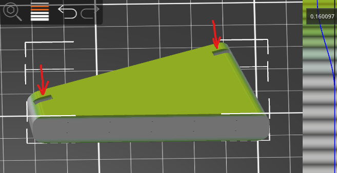

### FS Macro Panel - Stand

* Filament:
  * Prusa Silver PLA (used for assembled devices)
  * Amazon Basics Silver PLA (good colour match)
  * Basicfil Silver PLA (good colour match)

---
#### Single Stand

* [stand_left.stl](stand_left.stl)
* [stand_right.stl](stand_right.stl)

Print with the slots on top. Print one at a time to avoid stringing.

These are very suitable for variable layer height, set a smaller layer height for the top and bottom areas to help smooth our the curved egdes.

* Layer height: 0.15mm - 0.2mm (or use 0.35mm with variable layer hight, aiming for 0.15 or better on the top and bottom)
* Enable 'avoid crossing perimiters' to avoid possible stringing inside of the slots.
* Infill: 5% - 10%

---
#### Dual Stand

* [dual_stand_left.stl](dual_stand_left.stl)
* [dual_stand_right.stl](dual_stand_right.stl)

Print with the slots on top. Print one at a time to avoid stringing.

* Layer height: 0.15mm - 0.2mm (or use a variable layer height for more detail on the top and bottom layers)
* Infill: 10%

---
#### Stand / Mounting Dimensions

If you're interested in making your own stand or mount for FS Macro Panel, the dimensions of a single panel are as follows:

